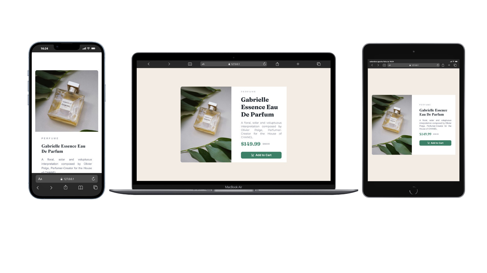

# ✨ Product Preview Card Component

Uma solução front-end para o desafio de cartão de visualização de produto, inspirado no design do Frontend Mentor.

## 🔎 Visão geral

Este projeto consiste em uma interface elegante e responsiva para apresentação de um perfume premium, com foco em:

- imagem do produto
- categoria do item
- título e descrição
- preços promocionais
- botão de compra

A implementação foi desenvolvida com HTML e CSS, priorizando layout responsivo, semântica e boa experiência visual.

## 🎯 Objetivo do desafio

Reproduzir fielmente o layout proposto, mantendo coerência visual, espaçamento, contraste e adaptação para diferentes resoluções de tela.

## 🛠️ Tecnologias utilizadas

- HTML5
- CSS3
- Google Fonts
- Bootstrap Icons

## ✨ Funcionalidades

- Layout responsivo para mobile e desktop
- Imagem adaptativa conforme o dispositivo
- Tipografia customizada
- Botão com hover estilizado
- Estrutura semântica em HTML

## 🖼️ Prévia



## ▶️ Como executar o projeto

1. Clone o repositório para sua máquina.
2. Acesse a pasta do projeto no VS Code.
3. Abra o arquivo `index.html` em um navegador.
4. Opcionalmente, utilize a extensão Live Server para visualizar as alterações em tempo real.

## 📁 Estrutura do projeto

```bash
.
├── index.html
├── style.css
├── images/
├── design/
├── README.md
├── style-guide.md
└── .gitignore
```

## 📝 Observações

- A pasta `images/` contém as imagens do produto em diferentes versões.
- A pasta `design/` serve como referência visual do layout proposto.
- O projeto foi desenvolvido como exercício prático de HTML semântico e CSS moderno.

## 📚 Aprendizados

Durante a implementação, foi possível praticar:

- organização estrutural em HTML
- uso de CSS para layout e espaçamento
- responsividade com media queries
- aplicação de fontes e paleta de cores
- construção de componentes visuais simples e atrativos

## 👏 Créditos

Desafio original do Frontend Mentor. 🎉

- Desafio: [Frontend Mentor](https://www.frontendmentor.io/);
- Solução: Lucas Albuquerque.

## 📄 Licença

Este projeto é de código aberto e está disponível sob a Licença MIT.

---

**Bom código! 🎉** Lembre-se, todo especialista foi um dia iniciante. Continue construindo, continue aprendendo!
